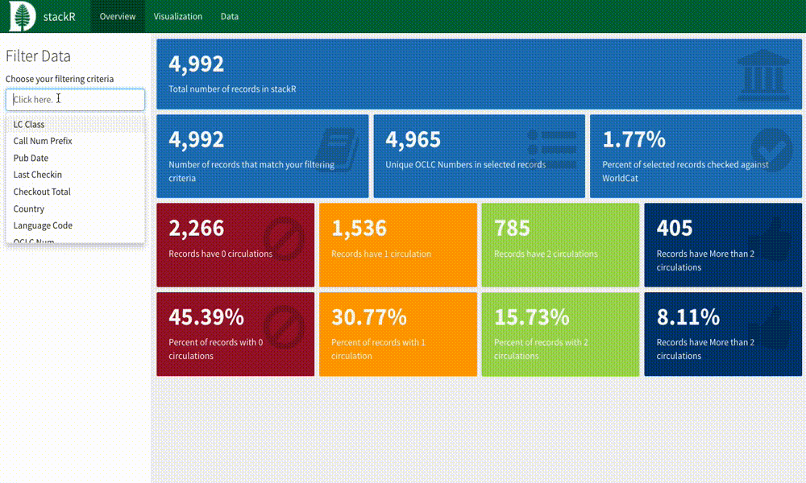
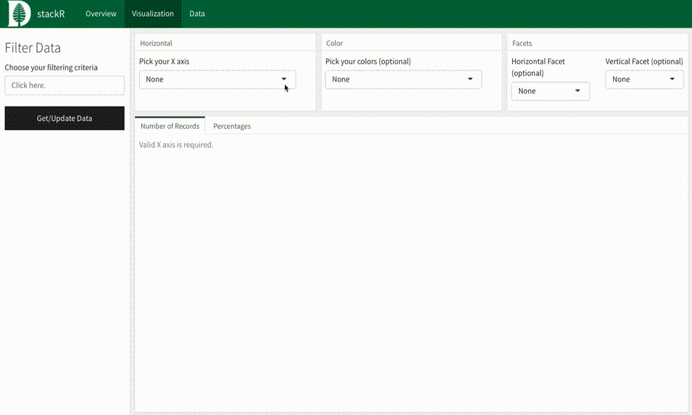
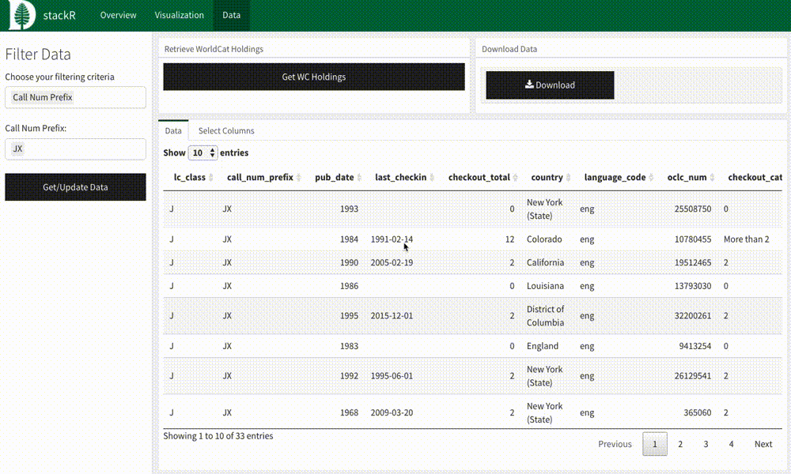

# stackR

`stackR` is a tool built to assist libraries in analyzing their collections data. It is primarily built using the [R programming language](http://r-project.org/), along with several popular R packages. It was initially developed with the needs of [Dartmouth Library](https://www.library.dartmouth.edu/) in mind, but is flexible enough to be useful for other libraries.

## Installation
`stackR` is a [Shiny](https://shiny.rstudio.com/) application, and should ideally be set up on a [Shiny Server](https://www.rstudio.com/products/shiny/shiny-server/). However, it is possible to run it locally by cloning this repository and using the "Run Document" button in RStudio while `index.Rmd` is open.

To run on a Shiny Server, please follow the documentation provided [here](https://www.rstudio.com/products/shiny/download-server/) to get your server set up.

To run locally, make sure you have the following installed on your machine:

- [R](https://www.r-project.org/) >3.5.0
- [RStudio](https://www.rstudio.com/products/rstudio/download/) >1.1.4

### Dependencies
`stackR` is dependent on the following R packages:

- [`tidyverse`](https://www.tidyverse.org/)
- [`shiny`](https://shiny.rstudio.com/)
- [`rmarkdown`](https://rmarkdown.rstudio.com/)
- [`flexdashboard`](https://rmarkdown.rstudio.com/flexdashboard/)
- [`ggiraph`](https://davidgohel.github.io/ggiraph/)
- [`DT`](https://rstudio.github.io/DT/)

On a Shiny server for which you have root access, you can install them from the command line with the following:
```shell
sudo su - -c "R -e \"install.packages(c('tidyverse', 'ggiraph', 'shiny', 'DT', 'flexdashboard'), repos='http://cran.rstudio.com/')\""
```


If you're running `stackR` on your local machine, you can install them by entering the following in an R terminal:
```R
install.packages(c("tidyverse", "shiny", "rmarkdown", "flexdashboard", "ggiraph", "DT"))
```

### Logo
By default, `stackR` uses the Dartmouth College D-Pine logo. To add your own, you should replace `www/images/logo.png` with your own logo. It should be exactly 48px high, per the [documentation](https://rmarkdown.rstudio.com/flexdashboard/using.html#logo__favicon) for `flexdashboard`.

### Favicon
You can change the favicon by replacing `www/images/icon.ico`.

### Colors/Styles
By default, `stackR` uses Dartmouth green as its main thematic color. You can change the style of stackR's theme using the stylesheet at `www/css/style.css`. These are the two primary colors to find and replace are:

- `#00693E`: The primary color of the navbar
- `#004D2D`: The color of any selected elements of the navbar

## Data
Because all libraries are interested in different data, and because the data they are able to export is not necessarily standardized, `stackR` is designed to ingest a variety of data fields. By default, it will look for a CSV at `data/test_data.csv`. There is a small, fake `test_data.csv` present to test the functionality `stackR`. To point `stackR` at a new file, put a CSV in the `data/` directory and change the `file` parameter in the header to point at your new file.

These are the only fields that are required to be in the CSV:

- `checkout_total`: an integer representing the total number of checkouts for an item
- `oclc_num`: an integer representing the OCLC number of an item, without any alphabetical characters ("ocm", etc.).

`stackR` will automatically detect the data types of any other fields provided, and will generate filters appropriate to those fields. The types of data stackR will recognize are:

- Numeric (integers, doubles)
- Date (YYYY-MM-DD)
- Character string

By default, the following will be excluded from filtering variables:

- Any character variable with more than 1000 unique values
- Any numeric variable with more than 10000 unique values


## WorldCat API Integration

`stackR` is able to use WorldCat's Search API to retrieve holdings information associated with an OCLC number. To use this functionality, `stackR` requires a valid API key, usually available to member institutions. More information on signing up for a key and using the Search API can be found [here](https://www.oclc.org/developer/develop/web-services/worldcat-search-api.en.html).

If you have a valid API key, include it as plaintext on the first line of a file called `ws_key` in the main directory. This will allow you to download holdings information for items with OCLC numbers loaded into `stackR`. By default, users can download up to 3000 records at a time using the "Retrieve WC Holdings" button on the "Data" tab.

Downloaded holdings information will be stored in a subdirectory of the main app directory, `data/wc/`. You may need to assign ownership and read/write permissions for this directory to the Shiny user and group, `shiny:shiny`, in order for data to be stored correctly.

Records that have not been checked in WorldCat or did not return a valid response are assigned a value of `-1` by default.

## Using `stackR`

### Filters and Overview
You can filter down your data using the sidebar. When you select a field to use, a filter will be rendered in the sidebar. When you've set your filtering criteria, hit the "Get/Update Data" button.



### Data Visualization
`stackR` has a basic set of visualizations you can use to explore your collections data. You can view items by number of records using just an X-axis variable, or percentages by choosing an X-axis variable and a color variable. You can also add faceting variables to explore your data further.



### Data Page
The "Data" page in `stackR` allows users to view and download their filtered data at the item-record level. Using the "Select Column" tab of the bottom box allows users to customize the columns present in the table.

This page also allows users to download WorldCat holdings information if a valid API key is provided (as outlined above).


